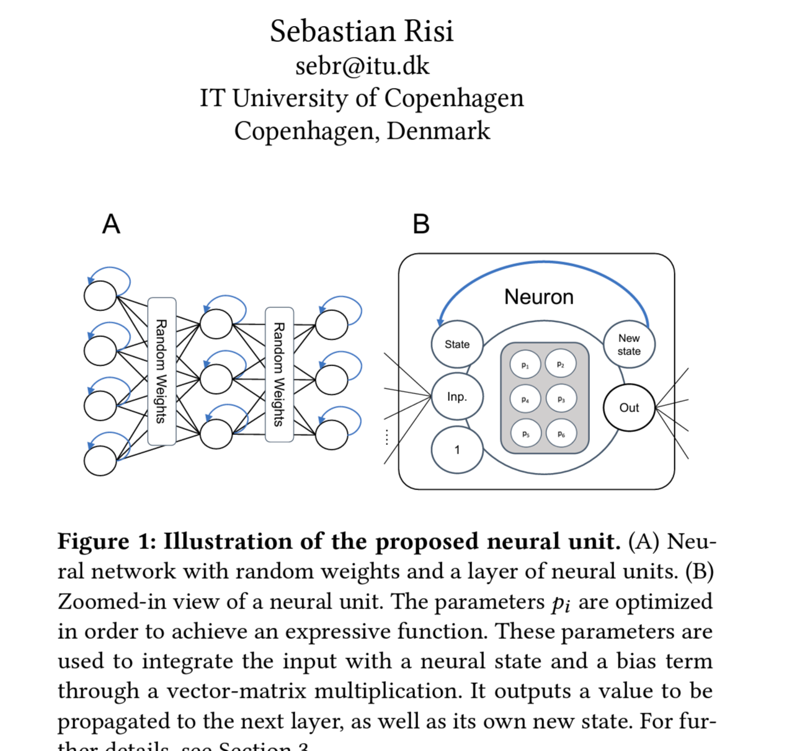

# wide_neural_nets_snd

Implementation of the following <a href='<https://arxiv.org/abs/2305.15945'>paper</a>

## Neurons abstracted into layer class
Here, a layer of neurons and their signals. A vector composed of input and state.

## Layers as network

connections are based on k strongest connections as measured by the  min( [abs(difference between states) .... nth compare], k )

